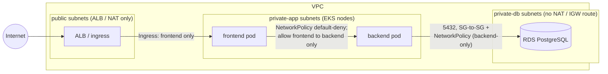

# Private database connectivity

How the backend reaches PostgreSQL without the database ever being
reachable from the internet. Everything below describes what the code in
this repo actually declares — [`terraform/`](../terraform/README.md) for
the AWS layer, [`k8s/`](../k8s/README.md) for the cluster layer — not a
hypothetical architecture.

## 1. How EKS connects privately to the database

A request never leaves the VPC on its way to the database. The full path:

backend pod → node ENI (private-app subnet) → RDS ENI (private-db
subnet). Both ENIs are private IPs inside the same VPC; the hop between
them is plain intra-VPC routing (the implicit `local` route), with zero
internet, NAT, or peering hops. The only internet-facing component in the
whole request path is the ALB in the public subnets, and it terminates at
the frontend.



Every hop is annotated with what actually blocks unauthorized traffic
there: the Ingress only routes to the frontend Service, the
NetworkPolicy's default-deny posture means the backend accepts nothing
except from frontend-labeled pods, and the database accepts nothing
except backend-labeled pods over 5432 — enforced twice, once by the
security group (which machines) and once by the NetworkPolicy (which
workloads).

The subnet tiers and their routing are defined in
[`terraform/modules/network/main.tf`](../terraform/modules/network/main.tf):
public subnets route to an internet gateway, private-app subnets egress
through NAT only, and the private-db route table has **no default route at
all** — the db tier cannot reach (or be reached from) anywhere outside the
VPC even in principle.

## 2. Private subnet / private endpoint design

**Our choice: RDS in dedicated db-tier subnets.** RDS is a VPC-native
service — its ENIs land directly in subnets we control — so "private" is
achieved with subnet placement plus `publicly_accessible = false`
([`terraform/modules/rds/main.tf`](../terraform/modules/rds/main.tf)),
no endpoint machinery required. The db subnets deliberately have no NAT
route (see the `private_db` route table in the network module): a database
makes no outbound calls, so it gets no path out, which is a stronger
guarantee than any firewall rule.

**Where VPC endpoints / PrivateLink apply instead:** services that are
*not* VPC-native — Secrets Manager, ECR, S3, STS — are normally reached
via public AWS API endpoints through the NAT gateway. That's acceptable
here (traffic is TLS and never transits the open internet unencrypted),
but a fully-private cluster (`endpoint_public_access = false`, no NAT)
would need **interface VPC endpoints** for exactly those services so nodes
can pull images (ECR + S3 gateway endpoint) and pods can fetch secrets
(Secrets Manager) without any internet path. That is the documented
hardening step beyond this assessment's scope — see the endpoint-access
trade-off note in
[`terraform/modules/eks/README.md`](../terraform/modules/eks/README.md).

## 3. Private DNS requirement

The RDS endpoint is a *hostname* (e.g.
`plinth-production-db.xxxx.ap-southeast-1.rds.amazonaws.com`),
not an IP. Inside the VPC it resolves through the VPC's Route 53 resolver
to the instance's **private IP** — which works because the network module
sets `enable_dns_support = true` and `enable_dns_hostnames = true` on the
VPC ([`terraform/modules/network/main.tf`](../terraform/modules/network/main.tf)).
From the public internet the same hostname either doesn't resolve or
resolves to nothing routable — there is no public IP to hand out, because
`publicly_accessible = false`.

Applications must always connect via the endpoint hostname, never a
resolved IP baked into config: RDS re-IPs the endpoint during Multi-AZ
failover, host maintenance, and instance class changes. A hardcoded IP
works until the first failover, then fails exactly when availability
matters most. The hostname is the stable contract; the IP behind it is
AWS's business.

## 4. Security group / firewall rules

The actual rule chain, as declared in code:

| # | Rule | Where | Effect |
|---|------|-------|--------|
| 1 | RDS SG ingress: TCP 5432, source = **EKS node SG** (SG reference, not CIDR) | [`terraform/modules/rds/main.tf`](../terraform/modules/rds/main.tf) (`db_ingress_from_nodes`) | Only traffic originating from a member of the node SG reaches PostgreSQL |
| 2 | Node SG egress: allow all | [`terraform/modules/eks/security.tf`](../terraform/modules/eks/security.tf) (`node_egress_all`) | Nodes can initiate to RDS (and ECR/S3/STS via NAT) |
| 3 | RDS SG: no other ingress rule exists | same file | Everything else — including other VPC resources — is denied by default |

**Why SG-to-SG beats CIDR rules:** the source is *membership*, not an
address range. Nodes scale up, get replaced by a new node group, or move
across subnets — the rule tracks them automatically with nothing to update
and no stale CIDR quietly widening over time. A CIDR rule covering the
private-app subnets would also admit *anything* placed in those subnets
later; the SG reference admits only EKS worker nodes.

Defense layers, outermost first: **no public IP**
(`publicly_accessible = false`) → **no route** (db subnets have no
IGW/NAT path) → **security group** (5432 from node SG only) →
**NetworkPolicy** inside the cluster (next section). Each layer would have
to fail independently for exposure to occur.

## 5. How ONLY the backend can access the database

The SG chain in section 4 is cloud-level: it guarantees only *EKS nodes*
can reach 5432 — but any pod scheduled on those nodes shares the node's
network identity, so the SG alone can't distinguish backend pods from,
say, frontend pods. Two more layers close that gap:

1. **Kubernetes NetworkPolicy** —
   [`k8s/base/network-policies.yaml`](../k8s/base/network-policies.yaml)
   applies `default-deny-ingress` to every pod, then
   `allow-frontend-to-backend-and-backend-to-postgres` admits port 5432
   ingress to the database **only from pods labeled
   `app.kubernetes.io/name: backend`**. A compromised frontend pod cannot
   open a connection to the database; the CNI drops it before it leaves
   the cluster's network fabric. (Locally this guards the in-cluster
   postgres stand-in; against RDS the same policy shape applies as an
   egress rule on non-backend pods.)
2. **Least-privilege database grants** — the application role the backend
   uses should own only its schema: no `SUPERUSER`, no `CREATEDB`, no
   access to other databases. Even a pod that somehow reaches 5432 with
   stolen credentials is then bounded by what that role can do.

Cloud SG answers "which machines," NetworkPolicy answers "which
workloads," grants answer "which operations." Only the backend passes all
three.

## 6. How credentials are stored securely

**The master password never exists in Terraform.**
`manage_master_user_password = true`
([`terraform/modules/rds/main.tf`](../terraform/modules/rds/main.tf))
has RDS generate the password and store it directly in AWS Secrets
Manager. There is deliberately no `db_password` variable anywhere in
`terraform/` — nothing to leak via tfvars, plan output, state, or git.
Rationale and the `random_password` + SSM alternative are covered in
[`terraform/README.md`](../terraform/README.md) section 7.

**How pods consume it:** External Secrets Operator (or the Secrets Store
CSI driver) runs under an IRSA-scoped IAM role — pods assume the role via
the cluster's OIDC provider
([`terraform/modules/eks/iam.tf`](../terraform/modules/eks/iam.tf)),
so no node-level or long-lived credentials are involved — reads the
Secrets Manager value, and materializes it as a Kubernetes `Secret` that
the backend mounts as `DATABASE_URL`. The committed
[`k8s/base/backend-secret-example.yaml`](../k8s/base/backend-secret-example.yaml)
is a clearly-labeled local-dev placeholder; staging/production never apply
real values from the repo.

**Rotation:** Secrets Manager rotates the master password on a schedule
without Terraform involvement. Because pods read the secret at startup,
rotation needs a propagation step: External Secrets Operator refreshes the
k8s Secret on its polling interval, and a rollout restart (or a reloader
sidecar/annotation watching the Secret) recycles backend pods so they pick
up the new value before the old one is invalidated.

## 7. How to confirm the database is NOT publicly accessible

Checklist, runnable against a real deployment:

```bash
# 1. The instance itself says so
aws rds describe-db-instances \
  --db-instance-identifier plinth-production-db \
  --query 'DBInstances[0].PubliclyAccessible'     # must be false

# 2. Public DNS gives you nothing usable (run from outside the VPC)
nslookup <rds-endpoint-hostname>                  # no public/routable IP

# 3. Direct connection from the internet fails
nc -zv -w 5 <rds-endpoint-hostname> 5432          # timeout, not refusal
psql "host=<rds-endpoint> user=appuser" -c '\l'   # hangs/times out

# 4. Positive control: the same connection FROM A BACKEND POD works
kubectl exec deploy/backend -- \
  python -c "import socket; socket.create_connection(('<rds-endpoint>', 5432), 5); print('open')"

# 5. Audit the security group: nothing world-open on 5432
aws ec2 describe-security-group-rules \
  --filters Name=group-id,Values=<rds-sg-id> \
  --query 'SecurityGroupRules[?ToPort==`5432`]'   # source must be the node SG, never 0.0.0.0/0

# 6. Audit the db-tier route tables: no path out
aws ec2 describe-route-tables \
  --filters Name=tag:Name,Values='*private-db*' \
  --query 'RouteTables[].Routes'                  # only the local VPC route, no igw-/nat- entries
```

The timeout in step 3 versus the success in step 4 is the pair that
matters: same endpoint, same port — the only variable is where you're
standing. This mirrors the layered isolation already verified live on the
local cluster (deny-by-default NetworkPolicies, internal-only backend
service, ingress routing only to the frontend — see
[`k8s/README.md`](../k8s/README.md)).
