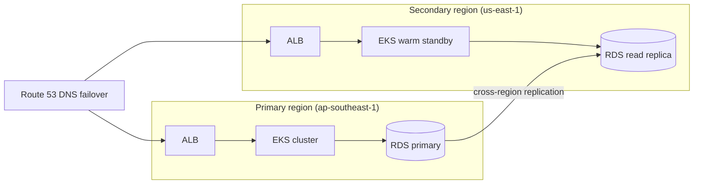

# Roadmap

Production hardening additions that are not yet implemented, grouped by
when they're worth doing rather than in build order. Each entry explains
what it is, why it matters, how to build it, what risk it removes, and —
honestly — why it isn't built yet. Improvements that are already in place
(Trivy image scanning, secrets rotation via Secrets Manager, blue-green
deployment support) are not repeated here.

---

## Now

Low effort, no unmet prerequisites — these could be picked up next without
waiting on anything else in this roadmap.

### 1. Horizontal Pod Autoscaler (HPA)

#### What it is

Kubernetes-native auto-scaling that adjusts replica counts based on
metrics (CPU, memory, or custom signals like request latency).

#### Why it's needed

The current manifests hard-code `replicas: 2` for both frontend and
backend. Two replicas survive a single-node failure, but they can't
absorb a traffic spike — the pods saturate, latency climbs, and the PDB
prevents manual scaling from reclaiming headroom fast enough.

#### How it helps

- Pods scale up automatically during traffic bursts (product launch,
  incident response) without human intervention.
- Pods scale down during quiet hours, reducing compute cost.
- Combined with PDBs (`k8s/base/pdb.yaml`), scaling respects
  availability guarantees — HPA never evicts below `minAvailable`.

#### How to build it

```yaml
# k8s/base/hpa.yaml
apiVersion: autoscaling/v2
kind: HorizontalPodAutoscaler
metadata:
  name: backend
spec:
  scaleTargetRef:
    apiVersion: apps/v1
    kind: Deployment
    name: backend
  minReplicas: 2
  maxReplicas: 10
  metrics:
    - type: Resource
      resource:
        name: cpu
        target:
          type: Utilization
          averageUtilization: 70
```

Requires the **Metrics Server** deployed to the cluster (`kubectl apply -f
https://github.com/kubernetes-sigs/metrics-server/releases/latest/download/components.yaml`).
For custom metrics (requests-per-second, p99 latency), install
**Prometheus Adapter** and define `MetricRule` objects.

#### Risk removed

- Outages from sudden traffic spikes.
- Over-provisioning during low-traffic periods (cost waste).

#### Why not built yet

There's no real traffic to autoscale against — a single-command demo
doesn't generate a load curve, and tuning `averageUtilization` without
one is guesswork dressed up as configuration.

---

### 4. Centralized logging

#### What it is

Aggregating logs from all pods, nodes, and cluster components into a
single queryable store (Loki, Elasticsearch, or CloudWatch Logs).

#### Why it's needed

Today, logs are only accessible via `kubectl logs` — which:
- Disappears when a pod is deleted or rescheduled.
- Can't be queried across pods ("show me all 500 errors in the last
  hour").
- Has no retention beyond the kubelet's disk buffer.

#### How it helps

- **Debugging:** search logs across all backend replicas for a specific
  error pattern.
- **Alerting:** trigger alerts on log patterns (e.g. spike in database
  connection errors).
- **Compliance:** retain logs for audit requirements.
- **Correlation:** trace a request across frontend → backend → database
  by matching request IDs in logs.

#### How to build it

**Loki + Promtail (lightweight, cloud-native):**

1. Deploy Promtail as a DaemonSet — it tails container log files on every
   node and ships them to Loki.
2. Deploy Loki as the log store — it indexes labels (namespace, pod,
   container) without full-text indexing, keeping storage costs low.
3. Grafana queries Loki with LogQL: `{namespace="plinth",
   app="backend"} |= "ERROR"`.

**For AWS:** Ship to CloudWatch Logs via the CloudWatch Logs agent, then
query with CloudWatch Insights. No additional infrastructure needed if the
cluster already ships control-plane logs to CloudWatch (it does — see
`terraform/modules/eks/main.tf`).

#### Risk removed

- Lost diagnostic data after pod deletion.
- Blind spots during incidents (can't see what happened).
- Inability to meet log retention compliance requirements.

#### Why not built yet

CloudWatch already receives EKS control-plane and application logs
(`terraform/modules/monitoring`) — the missing piece is only the
Loki/Grafana query layer on top, which is additive rather than blocking
anything else on this list.

---

### 5. Image signing with Sigstore/cosign

#### What it is

Cryptographic signing of container images at build time, and verification
at deploy time — proving that the image running in the cluster was built
by your pipeline and hasn't been tampered with.

#### Why it's needed

Trivy scans for known vulnerabilities (already in place), but it doesn't
answer: "was this image actually built from my source code, by my CI
pipeline?" A compromised registry or supply-chain attack could push a
malicious image tagged with a valid version number.

#### How it helps

- **Supply-chain security:** only images signed by your CI key can be
  deployed.
- **Tamper detection:** a modified image (even from the same registry)
  fails verification.
- **Audit:** every deployed image has a verifiable provenance chain.

#### How to build it

1. **At build time** (in CI, after pushing the image):
   ```bash
   cosign sign --key cosign.key $IMAGE:$TAG
   ```
   Store the private key in GitHub Secrets; the public key is committed
   to the repo.

2. **At deploy time** (via admission controller or ArgoCD):
   ```bash
   cosign verify --key cosign.pub $IMAGE:$TAG
   ```

3. **Enforce with Kyverno or OPA Gatekeeper** — create a policy that
   rejects any pod whose image signature can't be verified.

#### Risk removed

- Supply-chain attacks via compromised image registries.
- Accidental deployment of images built from untrusted forks.
- Tampered images reaching production undetected.

#### Why not built yet

It needs a persisted signing key and a verifying admission controller —
real new moving parts for a demo pipeline whose current gate (Trivy)
already covers the more common risk (known CVEs, not provenance).

---

## Next

Depend on groundwork from the Now items, or on each other — worth doing
once the sequencing makes sense, not blocked on anything external.

### 2. GitOps with ArgoCD

#### What it is

Declarative, auditable, continuously-reconciled deployment. ArgoCD watches
a Git repository and ensures the cluster state matches what's committed —
no manual `kubectl apply` needed.

#### Why it's needed

The current CI pipeline applies manifests directly (`kubectl apply -k`).
This works, but:
- There's no drift detection — someone can `kubectl edit` a deployment
  and nothing reverts it.
- Rollbacks require re-running the pipeline or manual `kubectl rollout
  undo`.
- There's no deployment history beyond Git commits and CI run logs.

#### How it helps

- **Drift detection:** ArgoCD detects when the live cluster state diverges
  from Git and either auto-syncs or alerts.
- **One-click rollback:** revert a Git commit and ArgoCD rolls back the
  cluster.
- **Audit trail:** every deployment is a Git commit with an author, timestamp,
  and diff.
- **PR-based deployments:** promote to production by merging a PR, not by
  running a pipeline manually.

#### How to build it

1. Install ArgoCD in the cluster:
   ```bash
   kubectl create namespace argocd
   kubectl apply -n argocd -f https://raw.githubusercontent.com/argoproj/argo-cd/stable/manifests/install.yaml
   ```
2. Create an `Application` resource pointing at the Kustomize overlay:
   ```yaml
   apiVersion: argoproj.io/v1alpha1
   kind: Application
   metadata:
     name: plinth
   spec:
     project: default
     source:
       repoURL: https://github.com/iAhmedMusa/plinth
       path: k8s/overlays/production
     destination:
       server: https://kubernetes.default.svc
       namespace: plinth
     syncPolicy:
       automated:
         prune: true
         selfHeal: true
   ```
3. Remove the `kubectl apply` step from the CI pipeline — the pipeline
   builds and pushes images, ArgoCD handles the deploy.

#### Risk removed

- Configuration drift between environments.
- Undeployed changes that someone thought were applied.
- Rollback errors from manual `kubectl` commands.

#### Why not built yet

There's no persistent cluster to reconcile against — the ephemeral kind
cluster this repo already uses is deliberately throwaway (see the ADR on
ephemeral staging verification), and GitOps needs something long-lived
to make sense of "drift."

---

### 3. Canary deployments

#### What it is

Gradually shifting traffic from the old version to the new version,
monitoring error rates and latency at each step, and automatically
rolling back if the canary degrades.

#### Why it's needed

Blue-green deployments (already supported) swap 100% of traffic at once.
Canary deployments reduce risk by exposing only a small percentage of
traffic to the new version first — catching issues before they affect all
users.

#### How it helps

- A bug in the new version only affects 5-10% of users, not 100%.
- Automated rollback based on real metrics (error rate, latency), not
  just health checks.
- Faster feedback loop — developers know within minutes if a release is
  healthy.

#### How to build it

**Option A: Argo Rollouts (recommended)**

Replace the `Deployment` with a `Rollout` resource:
```yaml
apiVersion: argoproj.io/v1alpha1
kind: Rollout
metadata:
  name: backend
spec:
  replicas: 10
  strategy:
    canary:
      steps:
        - setWeight: 5
        - pause: { duration: 5m }
        - setWeight: 25
        - pause: { duration: 10m }
        - setWeight: 50
        - pause: { duration: 10m }
        - setWeight: 100
      analysis:
        templates:
          - templateName: success-rate
        startingStep: 1
```

**Option B: Flagger + Istio/Linkerd**

Flagger watches canary metrics from the service mesh and adjusts traffic
splitting automatically. Works with existing Deployments (no resource
type change).

#### Risk removed

- Bad releases taking down the entire service.
- Long rollback windows — canary rollback is near-instant.

#### Why not built yet

Argo Rollouts assumes the GitOps control plane from item 2 already
exists — this is a sequencing dependency, not a separate unsolved
problem.

---

### 6. Policy enforcement with OPA Gatekeeper

#### What it is

An admission controller that evaluates every Kubernetes resource creation
against Rego policies before the API server accepts it.

#### Why it's needed

The current setup relies on code review and CI to enforce standards
(non-root, resource limits, image pinning). But nothing stops a manual
`kubectl apply` from bypassing those checks. Gatekeeper makes the
policies mandatory at the cluster level.

#### How it helps

- **Prevent `latest` tags:** reject any pod using an untagged or `latest`
  image.
- **Enforce resource limits:** reject pods without CPU/memory requests
  and limits.
- **Block privileged containers:** reject pods with
  `allowPrivilegeEscalation: true` or `runAsRoot: true`.
- **Restrict registries:** only allow images from approved registries
  (Docker Hub, ECR).

#### How to build it

1. Install Gatekeeper:
   ```bash
   kubectl apply -f https://raw.githubusercontent.com/open-policy-agent/gatekeeper/v3.16.0/deploy/gatekeeper.yaml
   ```

2. Define a constraint template (e.g. disallow `latest` tags):
   ```yaml
   apiVersion: templates.gatekeeper.sh/v1
   kind: ConstraintTemplate
   metadata:
     name: k8simagepolicy
   spec:
     crd:
       spec:
         names:
           kind: K8sImagePolicy
     targets:
       - target: admission.k8s.gatekeeper.sh
         rego: |
           package k8simagepolicy
           violation[{"msg": msg}] {
             container := input.review.object.spec.containers[_]
             endswith(container.image, ":latest")
             msg := sprintf("Image %v uses :latest tag", [container.image])
           }
   ```

3. Apply the constraint to the `plinth` namespace.

#### Risk removed

- Misconfigured resources reaching production.
- Security regressions from manual `kubectl` commands.
- Inconsistent enforcement across environments.

#### Why not built yet

Same blocker as GitOps (item 2): Gatekeeper needs a live cluster to
admit against continuously, not an ephemeral one that's torn down at the
end of every CI run.

---

## Later

Real, but sized for a system with actual users and budget behind it —
premature here.

### 7. Disaster recovery and multi-region

#### What it is

A strategy to recover from a complete region outage (AWS region
unavailable) or catastrophic data loss, with concrete RTO/RPO targets and
tested procedures.

#### Why it's needed

The current setup is single-region (ap-southeast-1). If that region goes
down:
- The EKS cluster is unreachable.
- The RDS instance is unavailable (even with Multi-AZ, which is
  same-region failover).
- There's no documented recovery procedure or tested backup restore
  beyond the single-region path in
  [`docs/operations/disaster-recovery.md`](operations/disaster-recovery.md).

#### How it helps

- **Business continuity:** the service survives a region-wide failure.
- **Compliance:** many standards require documented and tested DR plans.
- **Confidence:** regular DR drills prove the backups actually work,
  not just that they exist.

#### How to build it

**Phase 1: Backup strategy**

- Enable automated RDS backups with point-in-time recovery (already
  configured: `backup_retention_period` in `terraform/modules/rds/main.tf`).
- Snapshot ECR repositories to a second region.
- Store Terraform state in a versioned S3 bucket with cross-region
  replication.

**Phase 2: Cross-region read replica**

- Create an RDS read replica in a second region (us-east-1).
- In a failover scenario, promote the read replica to standalone and
  update the `DATABASE_URL` in Secrets Manager.

**Phase 3: Warm standby cluster**

- Deploy a smaller EKS cluster in the secondary region via the same
  Terraform modules (separate tfvars, separate state key).
- ArgoCD watches the same Git repo — on failover, update the
  `Application` destination to point at the secondary cluster.

**Phase 4: Failover automation**

- Route 53 health checks on the primary region's ALB.
- On failure, Route 53 DNS failover routes traffic to the secondary
  region's ALB.
- Document and test the full failover quarterly.



#### Risk removed

- Complete service outage from a region failure.
- Data loss from untested backups.
- Extended downtime during disaster recovery.

#### Why not built yet

It multiplies infrastructure cost and operational surface for a repo
with no real users to protect. The honest current ceiling is the
single-region backup/restore path in
[`docs/operations/disaster-recovery.md`](operations/disaster-recovery.md)
— multi-region is the right next step only once there's traffic that
would actually suffer from a regional outage.

---

## Summary

| # | Improvement | Group | Risk removed | Effort |
|---|---|---|---|---|
| 1 | HPA autoscaling | Now | Traffic spikes, cost waste | Low |
| 2 | GitOps (ArgoCD) | Next | Drift, rollback errors | Medium |
| 3 | Canary deployments | Next | Bad releases affecting all users | Medium |
| 4 | Centralized logging | Now | Lost diagnostics, blind spots | Low |
| 5 | Image signing | Now | Supply-chain attacks | Low |
| 6 | OPA Gatekeeper | Next | Policy bypass via manual apply | Medium |
| 7 | Multi-region DR | Later | Region-wide outage | High |
