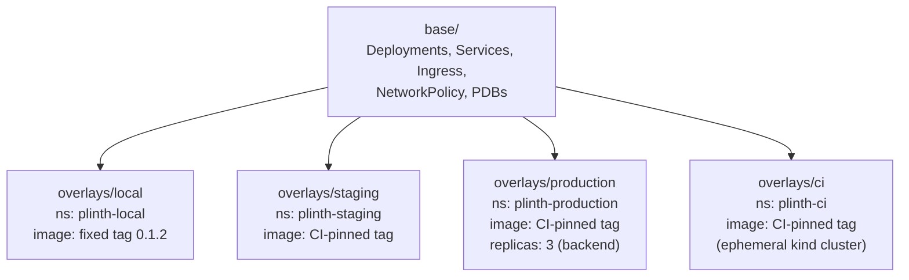

# Kubernetes manifests (Kustomize)

Traffic flows `ingress-nginx -> frontend -> backend (ClusterIP, internal-only) -> postgres`.

Locally, postgres runs in-cluster as a dev stand-in. Staging/production point the backend at a managed cloud database instead — `k8s/base/postgres.yaml` is never applied there.

## Local run

1. Install ingress-nginx:
   ```bash
   kubectl apply -f https://raw.githubusercontent.com/kubernetes/ingress-nginx/controller-v1.11.2/deploy/static/provider/cloud/deploy.yaml
   ```

2. Deploy:
   ```bash
   kubectl apply -k k8s/overlays/local
   ```

3. Check pods:
   ```bash
   kubectl get pods -n plinth-local
   ```

4. Open http://plinth.localtest.me (resolves to 127.0.0.1 via public DNS).

## Environment promotion

Every overlay starts from the same `base/` and only overrides what that
environment actually needs to differ:



`local` is the only overlay with a hand-set image tag — the rest get
theirs from CI (`kustomize edit set image` for `ci`, the same mechanism
for `staging`/`production` in a real pipeline). `production` is the only
overlay that patches replica count above the base default.

## Image tags

Base manifests use `PLACEHOLDER/plinth-{backend,frontend}:0.0.0`. Each overlay rewrites this to the real registry and a pinned semver tag. `latest` is never used.

## Requirements mapping

| Requirement | Where satisfied |
|---|---|
| 2 replicas (frontend & backend) | `base/frontend-deployment.yaml`, `base/backend-deployment.yaml` |
| Readiness/liveness probes | same (`/health` for backend, `/` for frontend) |
| Resource requests/limits | same |
| Non-secret config via ConfigMap | `base/backend-configmap.yaml` |
| Secret example (no real values) | `base/backend-secret-example.yaml` |
| Backend internal-only (ClusterIP) | `base/backend-service.yaml` |
| Ingress routes to frontend only | `base/ingress.yaml` |
| Pod hardening (non-root, drop caps, read-only rootfs) | both deployment files |
| Network isolation | `base/network-policies.yaml` |
| Disruption budgets | `base/pdb.yaml` |
| Per-environment overlays | `overlays/{local,staging,production}/kustomization.yaml` |

## Verify

```bash
kubectl apply -k k8s/overlays/local --dry-run=client
```
